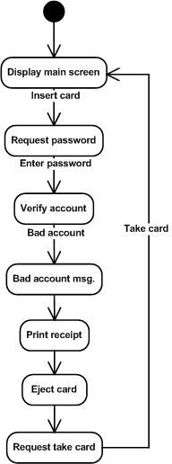

### status: Work in progress

### lab2_PR Project is based on the following requirements:

* Implement a protocol atop UDP, with error checking and retransmissions. Limit the number of retries for retransmission.
* Make the connection secure, using either a CA to get the public key of the receiver and encrypt data with it, or using Diffie-Helman to get a shared connection key between client and server, ensure that the traffic is encrypted.
* Regarding the application-level protocol, there are 3 options:
  - make an FTP-like protocol for data transfer, thus you will need to ensure data splitting and in-order delivery and reassembly at the destination. The protocol must support URIs, file creation and update (PUT), file fetching (GET) and metadata retrieval (OPTIONS)
  - make a protocol based on the workings (state machine) of an ATM
  - make a protocol based on the workings (state machine) of a stationary telephone

### Implementation:
  
  For the protocol atop UDP I have created two console applications which communicate with each other, UDPServer and UDPClient. They are running on same ip address and different ports. An udpEndPoint is created with _new IPEndPoint_ by passing parsed ip address and port number. The udpSocket binds this udpEndPoint. Next, while socket is available data can be sent from senderEndpoint to serverEndpoint and viceversa, with SendTo and ReceiveFrom methods. Code snippet from UDPClient Program.cs class. In UDPServer is pretty similar.

  
  To check for errors I used two methods, _GetHash()_ and _VerifyHash()_, first it takes the input string to a byte array and computes the hash, creates a new StringBuilder to collect the bytes and creates a string, it loops through each byte of hashed data and formats each one as a hexadecimal string and returns it. Second, verifies a hash against a string, hashes the input and creates a StringComparer to compare the hashes. To implement them in application and calculate checksum I used SHA256.
 

  
  From the client side I set a timeout of 5000 ms and a max number of retransmission to 5. To perform retransmission process I added a condition for while loop, to retransmit in case it didn't receive a response from the server and in case it didn't exceded the maximum number of retransmission.
  Output example, which goes down to 0 number of retries and then exits the program.

  
  To make connection secure I used Diffie Hellman key exchange method to get a shared connection key between client and server, and made sure the traffic is encrypted with the AES algoritm by encrypt and decrypt methods. DiffieHellman.cs class is located in lab2_PR folder. Client uses server's public key to encrypt his message, and server uses client' public key and IV to decrypt the encrypted message. Code snippet on how it was implemented on client and server side:

  
  Note: I wrote an unit test to test encrypt and decrypt message and it run successfully, but on implementation side it gives an error when decrypting message which I didn't manage to fix by trying different methods/other algorithms.
  
  Regarding the application-level protocol I started to implement the ATM state machine workings. It simulates the process of inserting a card, entering password which Server verifies if its correct and sends two options: to verify balance or to extract money. Server returns the response depending on client's input. Namely it follows this structure:
  

  
The output looks something like:
  

  
  Behind this lays a simple if else statement which checks for client's input on the server side. This is what I managed to implement so far, got little time in order to implement a better solution.
